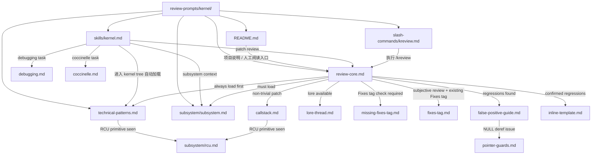

# Kernel Review Prompts 指向树（纵向 Mermaid 版）

这份文件用于补充 `kernel/learn.md`，专门说明 kernel review prompts 的工作机制与渐进式披露结构。

和此前的单张大图相比，这里有两个调整：

1. 使用自顶向下的竖向布局，优先保证主干链路可读。
2. 将 `subsystem/subsystem.md` 的大量子节点按组拆开，避免单个节点横向扇出过宽。

## 1. 总体工作机制：入口、主协议、条件加载

## 2. 渐进式披露主干：从 review-core 到 subsystem 分发表

```mermaid
flowchart TD
    A[review-core.md]
    A --> B[technical-patterns.md]
    A --> C[subsystem/subsystem.md]

    C --> D1[MM family]
    C --> D2[Core kernel family]
    C --> D3[I/O and storage family]
    C --> D4[Net and protocol family]
    C --> D5[Drivers and platform family]
    C --> D6[Tools and config family]
    C --> D7[Language and special topics]
    C --> D8[Optional patterns]

    D1 --> E1[mm-pagetable.md]
    D1 --> E2[mm-folio.md]
    D1 --> E3[mm-largepage.md]
    D1 --> E4[mm-vma.md]
    D1 --> E5[mm-alloc.md]
    D1 --> E6[mm-reclaim.md]

    D2 --> E7[vfs.md]
    D2 --> E8[locking.md]
    D2 --> E9[scheduler.md]
    D2 --> E10[timers.md]
    D2 --> E11[rcu.md]
    D2 --> E12[tracing.md]
    D2 --> E13[workqueue.md]
    D2 --> E14[syscall.md]
    D2 --> E15[cleanup.md]
    D2 --> E16[kho.md]

    D3 --> E17[block.md]
    D3 --> E18[dax.md]
    D3 --> E19[io_uring.md]
    D3 --> E20[pci.md]
    D3 --> E21[ata.md]
    D3 --> E22[usb-storage.md]
    D3 --> E23[io-accessors.md]
    D3 --> E24[cxl.md]
    D3 --> E25[dpll.md]

    D4 --> E26[networking.md]
    D4 --> E27[bpf.md]
    D4 --> E28[sunrpc.md]
    D4 --> E29[nfsd.md]
    D4 --> E30[bluetooth.md]
    D4 --> E31[wireless.md]
    D4 --> E32[can.md]
    D4 --> E33[smb-ksmbd.md]

    D5 --> E34[drm.md]
    D5 --> E35[pmdomain.md]
    D5 --> E36[pm.md]
    D5 --> E37[sysfs.md]
    D5 --> E38[tty.md]
    D5 --> E39[of.md]
    D5 --> E40[hwmon.md]
    D5 --> E41[media.md]
    D5 --> E42[input.md]
    D5 --> E43[i3c.md]
    D5 --> E44[irqchip.md]
    D5 --> E45[fscrypt.md]
    D5 --> E46[btrfs.md]

    D6 --> E47[perf.md]
    D6 --> E48[selftests.md]
    D6 --> E49[objtool.md]
    D6 --> E50[kconfig.md]
    D6 --> E51[dt-bindings.md]

    D7 --> E52[mips.md]
    D7 --> E53[rust.md]

    D8 --> E54[subjective-review.md]
```

## 3. 解释：为什么这版更适合阅读

### 3.1 先把“主流程”与“知识目录”分开

旧图最难读的原因，是把“谁触发谁”和“subsystem 目录展开”塞进了同一张图里。实际阅读时，这两类关系应该分开：

- 第一张图看工作机制
- 第二张图看知识树展开

### 3.2 用分组节点替代单层超大扇出

`subsystem/subsystem.md` 是一个分发表，但如果直接向几十个子系统 guide 同时出边，Mermaid 很容易横向铺开。把它先分成 family，再下钻到具体 guide，可读性会明显提高。

### 3.3 保留“渐进式披露”的语义

这版图没有改变原始逻辑，只是把它重新排版：

- 入口文档负责把用户引到主协议
- 主协议负责决定必须加载的共通知识
- subsystem 索引负责按 diff trigger 把知识进一步分发到局部 guide
- verification 与 reporting 文档只在后续阶段按条件出现

## 4. 一句话总结

kernel review prompts 的核心不是“把所有经验一次性塞给 agent”，而是把经验组织成：

入口 -> 主协议 -> 共通知识 -> 分发表 -> 子系统 guide -> 验证与输出

这就是它的渐进式披露机制。
