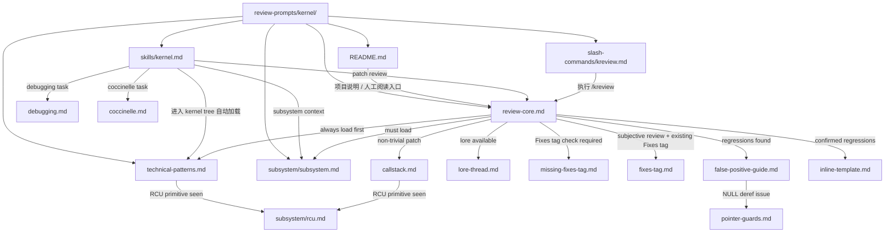
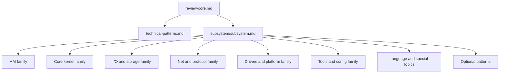
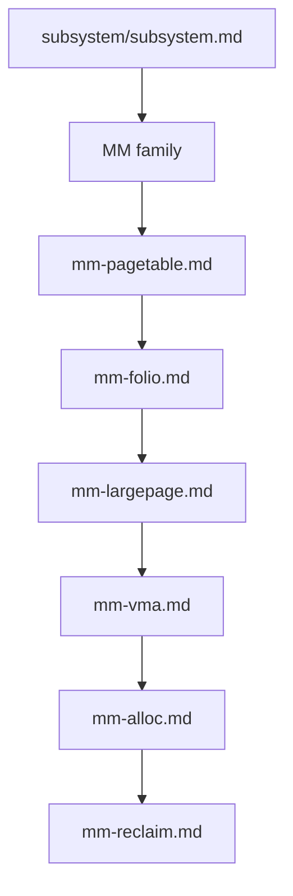
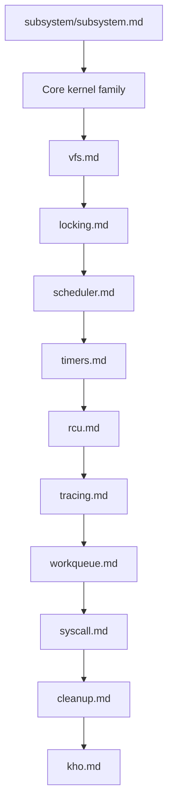
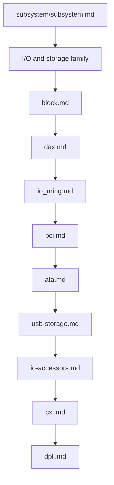
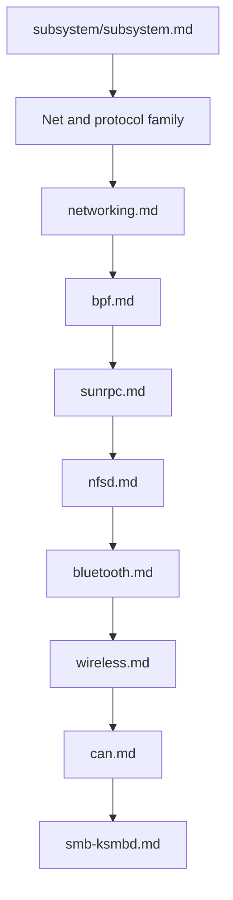
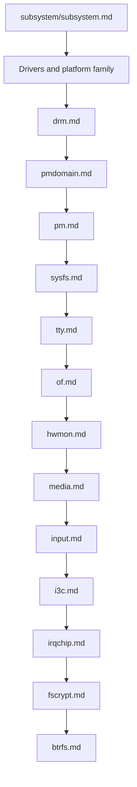
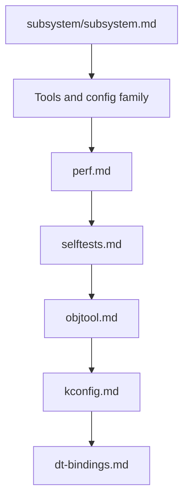
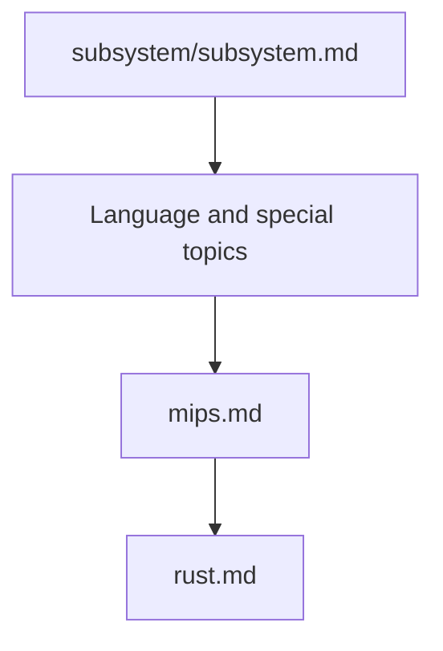
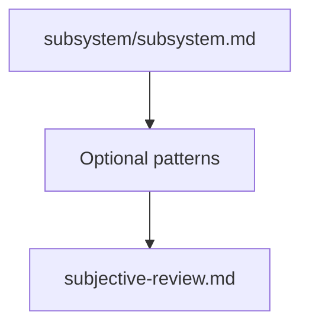

# Kernel Review Prompts 指向树（全纵向 Mermaid 版）

这份文件是 `learn-tree.md` 的补充版本，目标不是把所有节点挤成一张“大树”，而是让每一组下级节点都按纵向顺序展开。

因此，这里采用的表达方式是：

- 先给一张总览图
- 再把每一组 guide 拆成独立的小图
- 每张小图都只保留一条纵向链路

这样阅读时不会再出现单层横向扇出太宽的问题。

## 1. 总体工作机制：入口、主协议、条件加载

## 2. 渐进式披露主干：总览

## 3. 每组节点纵向排列

### 3.1 MM family

### 3.2 Core kernel family

### 3.3 I/O and storage family

### 3.4 Net and protocol family

### 3.5 Drivers and platform family

### 3.6 Tools and config family

### 3.7 Language and special topics

### 3.8 Optional patterns

## 4. 这种画法的含义

这种版本不是在强调“真实依赖关系是一个链表”，而是在强调“阅读顺序应该是纵向展开的”。

也就是说：

- 逻辑上，`subsystem/subsystem.md` 仍然是一个分发表
- 视觉上，我们故意把每一组 guide 画成纵向链，避免一层横向展开得太宽
- 这更适合在 Markdown 渲染器里阅读，也更适合在窄屏或普通编辑器里查看

## 5. 一句话总结

如果目标是表达“知识如何分组并逐层展开”，那么全纵向 Mermaid 比单张大树更容易读。
